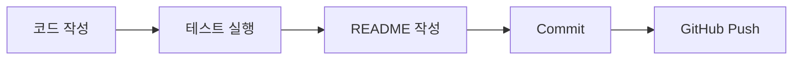

# Markdown README Guide

README는 프로젝트를 처음 보는 사람이 “이 프로젝트가 무엇이고 어떻게 실행하는지” 알 수 있게 해 주는 문서입니다.

GitHub에서는 `README.md` 파일을 자동으로 화면에 보여 줍니다. 그래서 프로젝트를 GitHub에 올릴 때 README를 잘 쓰는 것이 중요합니다.

## 1. README 기본 구조

````markdown
# 프로젝트 이름

이 프로젝트가 무엇을 하는지 한두 문장으로 설명합니다.

## 목표

- 목표 1
- 목표 2
- 목표 3

## 실행 방법

```powershell
python main.py
```

## 테스트 방법

```powershell
python -m pytest
```

## 학습 기록

- 배운 점
- 어려웠던 점
- 다음에 개선할 점
````

## 2. 제목 쓰기

Markdown에서는 `#`으로 제목을 만듭니다.

```markdown
# 가장 큰 제목
## 중간 제목
### 작은 제목
```

README에서는 보통 `#` 제목은 한 번만 사용합니다.

## 3. 목록 쓰기

```markdown
- Python 파일 작성
- 테스트 실행
- GitHub에 push
```

숫자 순서가 중요하면 번호 목록을 사용합니다.

```markdown
1. VS Code에서 파일을 수정합니다.
2. Source Control에서 변경 내용을 확인합니다.
3. Commit합니다.
4. GitHub에 Push합니다.
```

## 4. 코드 블록 쓰기

명령어는 코드 블록으로 씁니다.

````markdown
```powershell
python main.py
python -m pytest
```
````

Python 코드는 이렇게 씁니다.

````markdown
```python
def add(a: int, b: int) -> int:
    return a + b
```
````

## 5. 표 쓰기

```markdown
| 항목 | 설명 |
| --- | --- |
| main.py | 프로그램 실행 파일 |
| test_main.py | 테스트 파일 |
| README.md | 프로젝트 설명 문서 |
```

GitHub에서는 아래처럼 보입니다.

| 항목 | 설명 |
| --- | --- |
| main.py | 프로그램 실행 파일 |
| test_main.py | 테스트 파일 |
| README.md | 프로젝트 설명 문서 |

## 6. 링크 넣기

```markdown
[GitHub](https://github.com)
```

같은 프로젝트 안의 파일로 연결할 수도 있습니다.

```markdown
[테스트 파일](./test_main.py)
```

## 7. 이미지 넣기

이미지는 보통 `docs/images` 폴더에 넣습니다.

예시 구조:

```text
project
├─ README.md
└─ docs
   └─ images
      └─ test-result.png
```

README에서 이미지를 넣는 방법:

```markdown

```

주의:

```text
이미지 파일 이름이 정확해야 합니다.
경로는 README.md 위치를 기준으로 씁니다.
파일 이름에 공백을 넣지 않는 것이 좋습니다.
```

## 8. Mermaid 도표 넣기

GitHub README에서는 Mermaid 도표를 사용할 수 있습니다.

````markdown

````

위 코드는 GitHub에서 흐름도로 보입니다.

## 9. README에 쓰면 안 되는 것

아래 값은 README에 쓰면 안 됩니다.

```text
실제 API key
Supabase service role key
OpenAI API key
Gemini API key
Upstash Redis token
개인 비밀번호
.env 파일 내용 전체
```

환경변수는 예시 값만 씁니다.

```env
SUPABASE_URL=your-supabase-url
SUPABASE_ANON_KEY=your-supabase-anon-key
```

## 10. 좋은 README 체크리스트

```text
[ ] 프로젝트 이름이 있습니다.
[ ] 프로젝트 목적이 한두 문장으로 설명되어 있습니다.
[ ] 실행 방법이 있습니다.
[ ] 테스트 방법이 있습니다.
[ ] 필요한 파일 구조가 설명되어 있습니다.
[ ] 이미지 경로가 깨지지 않습니다.
[ ] 표가 보기 좋게 정리되어 있습니다.
[ ] Mermaid 도표가 있으면 GitHub에서 정상 표시됩니다.
[ ] 실제 key나 password가 없습니다.
```
