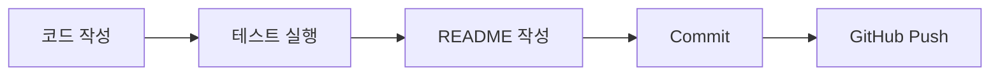

# Lab 02. Markdown README 작성

이 실습에서는 GitHub에서 보기 좋은 README를 작성합니다.

README는 프로젝트 설명서입니다. 코드를 처음 보는 사람이 README만 보고 프로젝트 목적, 실행 방법, 테스트 방법을 이해할 수 있어야 합니다.

## 실습 목표

```text
1. README에 제목과 설명을 작성할 수 있습니다.
2. 실행 방법을 코드 블록으로 작성할 수 있습니다.
3. 파일 구조를 표로 정리할 수 있습니다.
4. 이미지 링크를 넣을 수 있습니다.
5. Mermaid 도표를 넣을 수 있습니다.
```

## 1. README 열기

아래 파일을 엽니다.

```text
03_git-github/10_labs/practice-files/git-practice-project/README.md
```

## 2. 프로젝트 설명 작성

README 상단에 프로젝트 목적을 작성합니다.

예시:

```markdown
# Git Practice Project

이 프로젝트는 Git/GitHub 실습을 위해 만든 작은 Python 테스트 프로젝트입니다.
VS Code Source Control로 변경사항을 확인하고 GitHub에 올리는 흐름을 연습합니다.
```

## 3. 실행 방법 작성

````markdown
## 실행 방법

```powershell
python main.py
```
````

## 4. 테스트 방법 작성

````markdown
## 테스트 방법

```powershell
python -m pytest test_main.py
```
````

## 5. 파일 구조 표 작성

```markdown
| 파일 | 설명 |
| --- | --- |
| main.py | 연습용 Python 함수 파일 |
| test_main.py | pytest 테스트 파일 |
| README.md | 프로젝트 설명 문서 |
```

## 6. 이미지 링크 추가

테스트 실행 결과를 캡처했다면 아래 위치에 저장합니다.

```text
docs/images/test-result.png
```

README에 아래처럼 작성합니다.

```markdown
## 실행 결과


```

이미지가 아직 없어도 작성 방법을 연습합니다. GitHub에서 이미지가 깨지면 경로와 파일 이름을 확인합니다.

## 7. Mermaid 도표 추가

README에 아래 내용을 추가합니다.

````markdown
## 작업 흐름


````

## 8. Source Control에서 README 변경 확인

VS Code Source Control을 열고 README 변경 내용을 확인합니다.

확인할 내용:

```text
README.md가 Changes에 보이나요?
변경 파일을 클릭하면 추가한 제목, 표, 도표가 보이나요?
```

## 9. Commit 하기

README를 stage한 뒤 commit합니다.

commit message 예시:

```text
docs: add project README
```

## 정리 질문

```text
1. README는 왜 필요한가요?
2. 이미지 경로는 어떤 파일 위치를 기준으로 쓰나요?
3. README에 실제 API key를 쓰면 왜 안 되나요?
4. Mermaid 도표는 어떤 상황에서 유용한가요?
```
