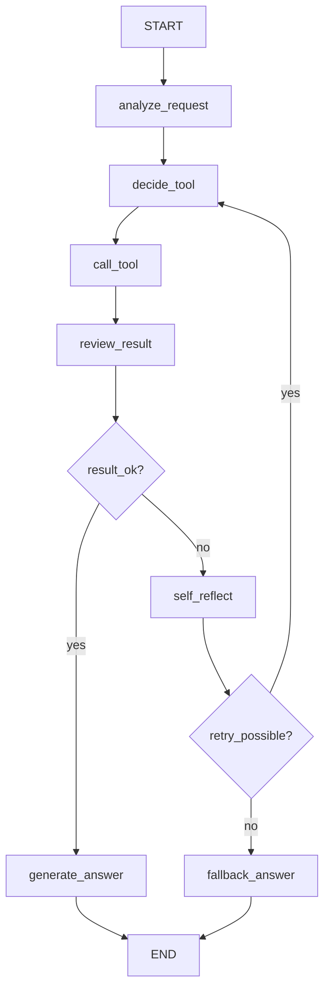

# 에이전트 아키텍처 설계서 샘플

## 1. 프로젝트 개요

| 항목 | 내용 |
| --- | --- |
| 프로젝트명 | 복합 API 연계 일정 조정 에이전트 |
| 목표 | 사용자의 일정 요청을 분석하고, 여러 Tool을 사용해 가능한 회의 시간을 제안한다. |
| 주요 사용자 | 팀 회의, 스터디, 상담 일정을 조정해야 하는 사용자 |
| 기본 구현 방식 | Mock data 기반 일정 조회 후 선택적으로 실제 API 연결 |

## 2. 전체 흐름

## 3. State 정의

| 필드 | 타입 | 설명 |
| --- | --- | --- |
| `messages` | `list[dict]` | 사용자와 Agent의 대화 기록 |
| `user_request` | `str` | 현재 처리 중인 요청 |
| `participants` | `list[str]` | 회의 참석자 |
| `date_range` | `str` | 요청 날짜 범위 |
| `duration_minutes` | `int` | 회의 길이 |
| `required_tools` | `list[str]` | 필요하다고 판단한 Tool |
| `tools_called` | `list[str]` | 실제 호출한 Tool |
| `tool_results` | `dict` | Tool 실행 결과 |
| `error_count` | `int` | 오류 또는 재시도 횟수 |
| `iteration` | `int` | Agent 반복 횟수 |
| `reflection_notes` | `list[str]` | 오류 분석과 수정 전략 |
| `final_answer` | `str` | 최종 응답 |

## 4. Node 설계

| Node | 입력 | 처리 | 출력 |
| --- | --- | --- | --- |
| `analyze_request` | `user_request` | 참석자, 날짜, 회의 길이 추출 | `participants`, `date_range`, `duration_minutes` |
| `decide_tool` | 현재 State | 필요한 Tool 선택 | `required_tools` |
| `call_tool` | `required_tools` | Tool 실행 | `tools_called`, `tool_results` |
| `review_result` | `tool_results` | 결과 충분성, 응답 일관성 검증 | `error_type`, `is_valid` |
| `self_reflect` | 오류 정보 | 원인 분석, 재시도/fallback 결정 | `reflection_notes`, `retry_plan` |
| `generate_answer` | 검증된 결과 | 일정 제안 응답 생성 | `final_answer` |
| `fallback_answer` | 실패 정보 | 안전한 대체 응답 생성 | `final_answer` |

## 5. Tool 설계

| Tool | 입력 | 출력 | 실패 처리 |
| --- | --- | --- | --- |
| `check_calendar_tool` | 참석자, 날짜 범위 | 참석자별 일정 목록 | 입력 누락 시 추가 질문 |
| `find_available_slot_tool` | 일정 목록, 회의 길이 | 가능한 시간 후보 | 후보 없음 시 대체 날짜 제안 |
| `draft_invitation_tool` | 선택 시간, 참석자 | 초대 메시지 | 선택 시간 없음 시 fallback |

## 6. 분기 정책

| 조건 | 처리 |
| --- | --- |
| 참석자 또는 날짜가 없음 | 추가 질문 |
| 필요한 Tool이 호출되지 않음 | `decide_tool`로 재시도 |
| Tool 결과가 비어 있음 | 대체 날짜 또는 시간 축소 제안 |
| 최종 답변이 Tool 결과와 다름 | `self_reflect` 후 응답 재생성 |
| `error_count >= 2` | fallback 응답 후 종료 |

## 7. 기억 전략

| 구분 | 적용 방식 |
| --- | --- |
| 단기 기억 | 현재 요청과 최근 대화는 `messages`에 저장 |
| 장기 기억 | 선택 구현. 이전 선호 시간, 자주 만나는 참석자 등을 별도 저장소에 저장 가능 |
| 요약 전략 | 대화가 길어지면 최근 요청, 참석자, 날짜, 결정된 시간만 요약 |

## 8. 구현 파일 연결

| 설계 요소 | 구현 위치 |
| --- | --- |
| State 타입 | `backend/app/schemas/agent_state.py` |
| Graph 구성 | `backend/app/graph/schedule_graph.py` |
| Tool 함수 | `backend/app/tools/schedule_tools.py` |
| API endpoint | `backend/app/routers/agent_router.py` |
| UI | `frontend/app.py` |
